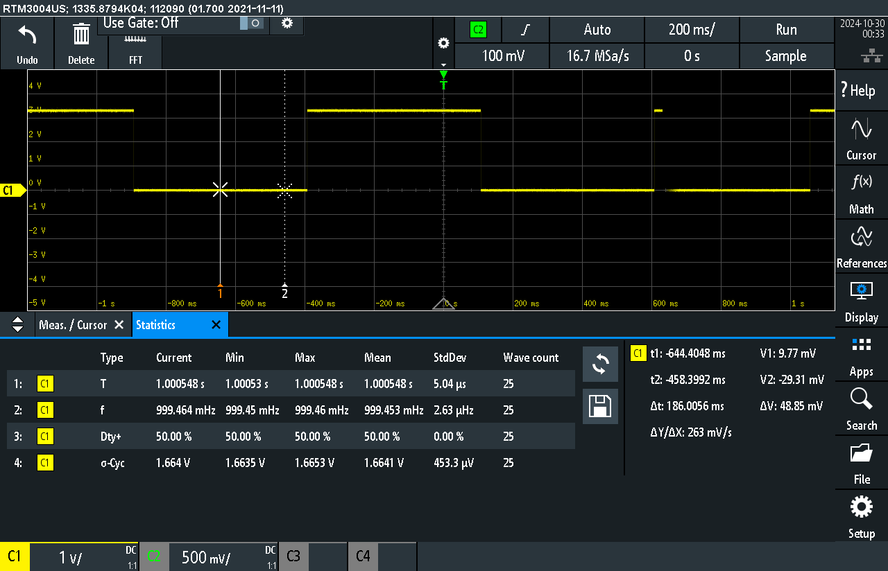
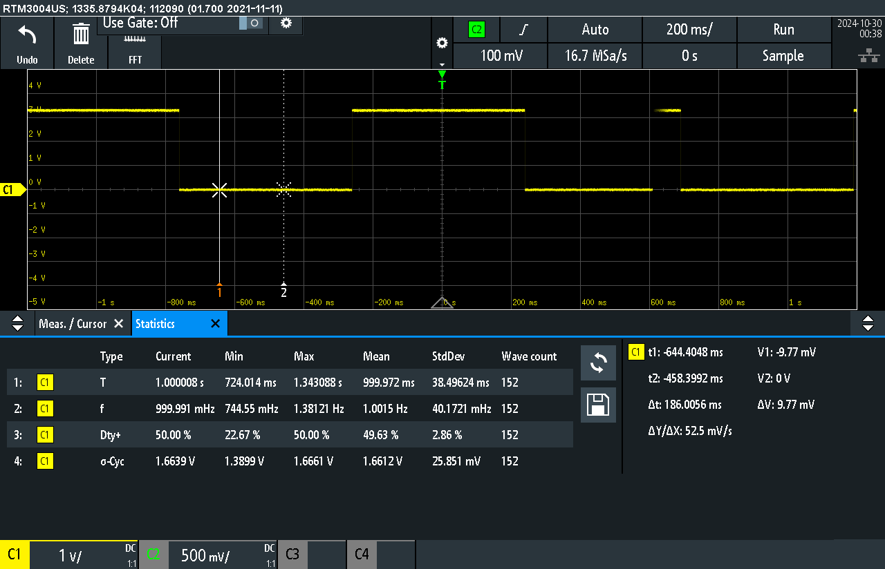
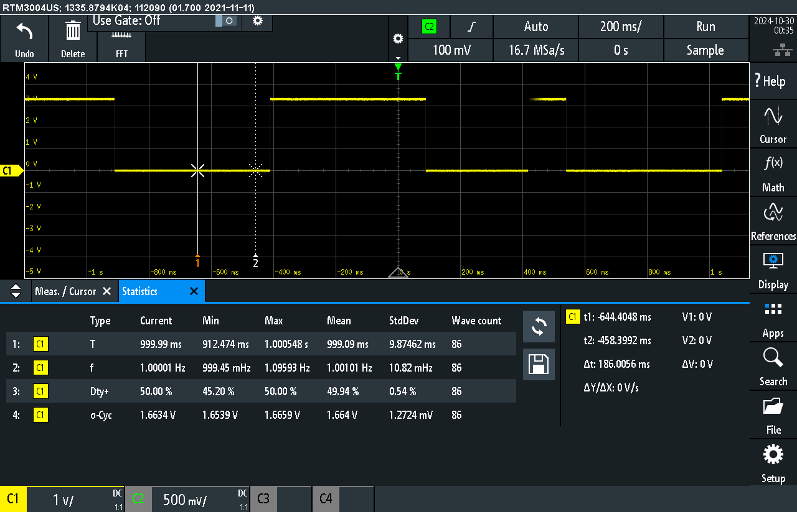
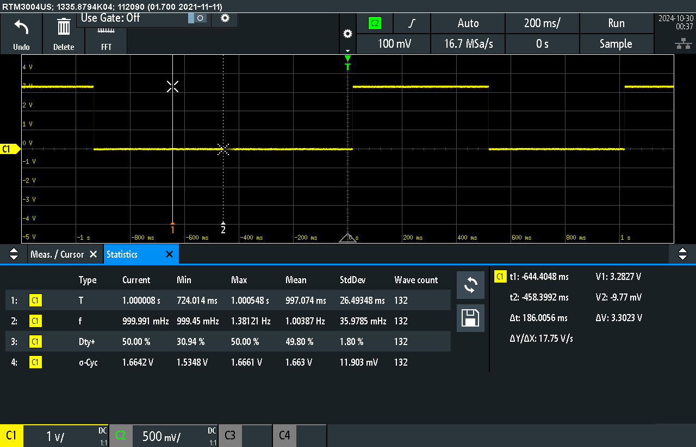
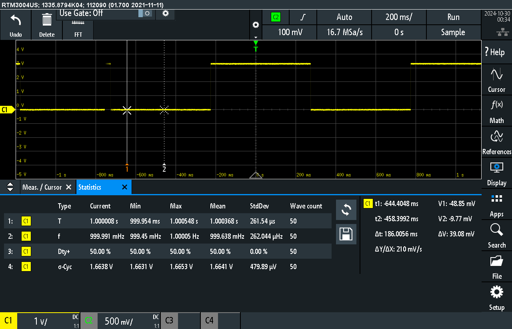

## sleep.c Measurement

*sleep.c*

## sleep.c  with busy loop Measurement

*sleep with busy loop.c*

## timer.c Measurement

*timer.c*

## timer.c  with busy loop Measurement

*timer with busy loop.c*

## task_delay.c Measurement

*task_delay.c*

## task_delay.c  with busy loop Measurement

*task_delay with busy loop.c*

## Agilent function generator Measurement

*Agilent function generator*